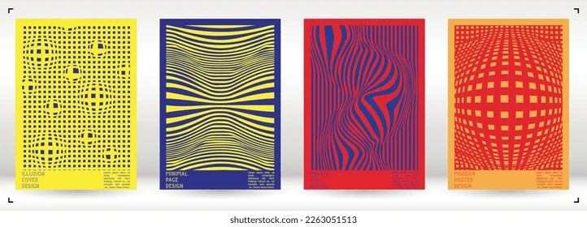
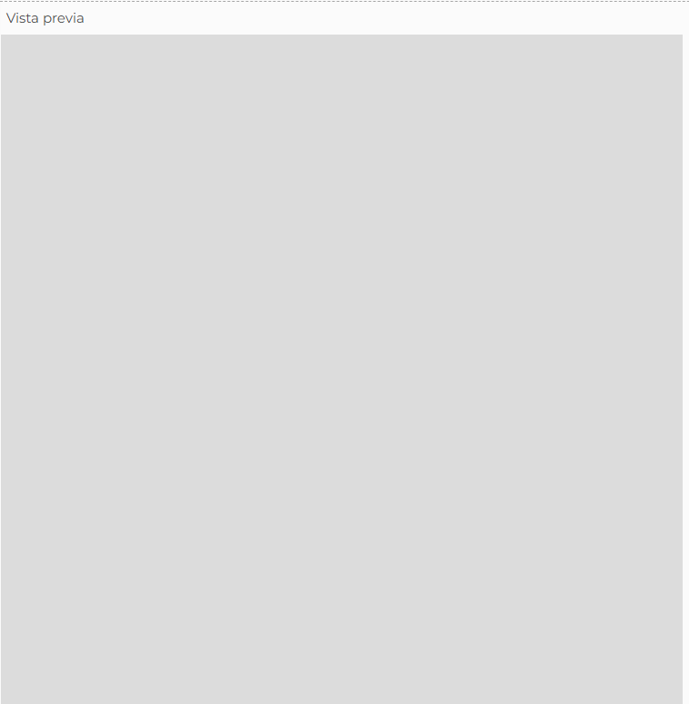
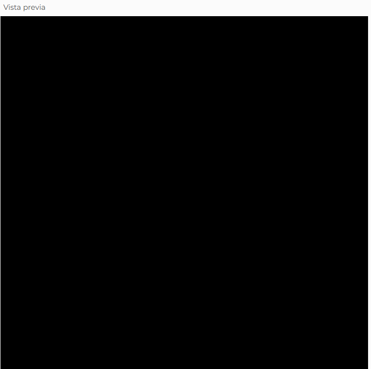
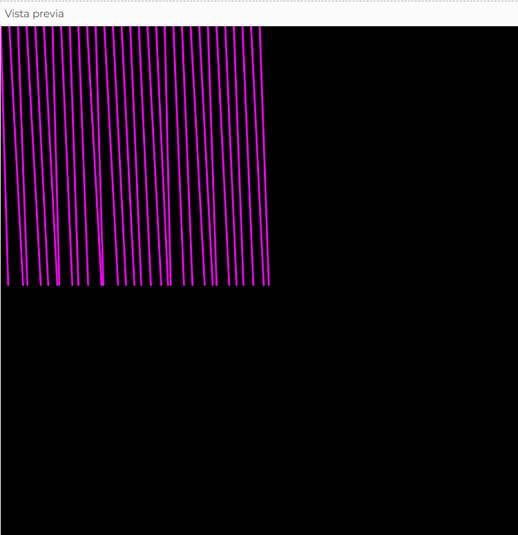
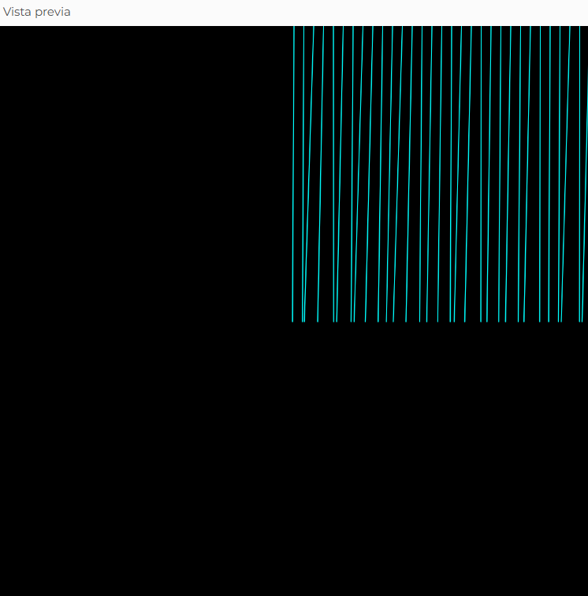
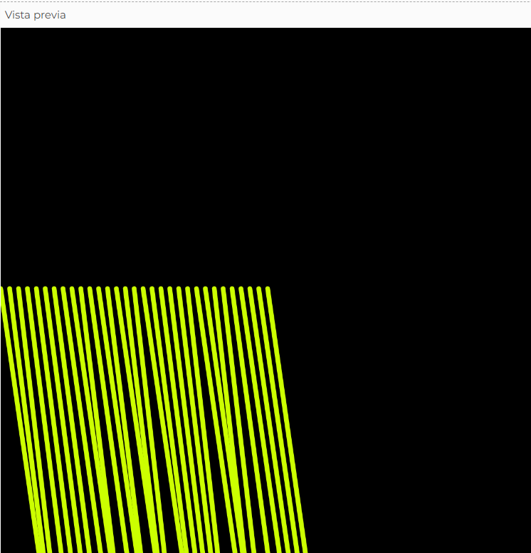
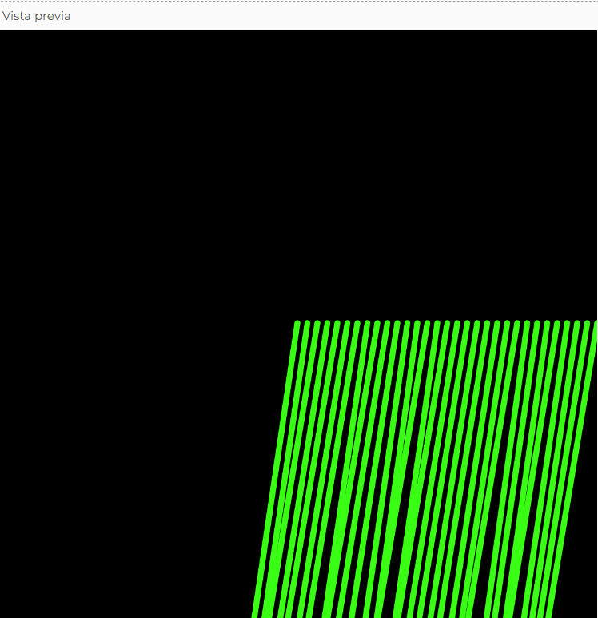

# Solemne2-secc6
Documentación de mi proceso
- Francisca Castro Martinez
  
## links 

- p5.js editable: https://editor.p5js.org/francisca.castro3/sketches/SywLGdMtY
- pantalla fija: https://editor.p5js.org/francisca.castro3/full/SywLGdMtY

## Un poco de nuestro enfoque para el proyecto


Las líneas son el elemento visual más directo para mostrar dirección y movimiento, lo que las hace ideales para un sistema que reacciona al mouse. Es por eso mi elección.

---

## Documentación del proceso

**Primer paso** Definir las variables globales. Usé dos: `cantidadLineas` para controlar cuántas líneas se dibujan, y `variacion` para agregar un temblor aleatorio a cada una.

```javascript
let cantidadLineas = 300;
let variacion = 5;

function setup() {
  createCanvas(600, 600);
  noFill();
}
```
#



**Segundo paso** En `draw()` definí el fondo negro, calculé los cuadrantes y usé `map()` para traducir la posición Y del mouse a un rango de grosor entre 0.5 y 8. Cuanto más abajo esté el mouse, más gruesas serán las líneas.

```javascript
function draw() {
  background(0);
  let anchoCuadrante = width / 2;
  let altoCuadrante = height / 2;

  let grosor = map(mouseY, 0, height, 0.5, 8);
  strokeWeight(grosor);

  for (let i = 0; i <= cantidadLineas; i = i + 10) {
    dibujarLinea(i, anchoCuadrante, altoCuadrante);
  }
}
```
#



**Tercer paso** Creé mi función propia `dibujarLinea()`. Dentro de ella usé `random()` para agregar un pequeño temblor a cada línea, haciéndolas más orgánicas y vivas. Luego me fijé en qué zona horizontal está el mouse y activé el cuadrante correspondiente con su color y dirección.

```javascript
function dibujarLinea(i, anchoCuadrante, altoCuadrante) {
  let temblor = random(-variacion, variacion);

  if (mouseX < 150) {
    stroke(255, 0, 255);
    line(i, 0, i + mouseX / 10 + temblor, altoCuadrante);
  }

  else if (mouseX < 300) {
    stroke(0, 255, 255);
    line(i + 300, 0, i + 300 - mouseY / 10 + temblor, altoCuadrante);
  }

  else if (mouseX < 450) {
    stroke(204, 255, 0);
    line(i, 300, i + mouseY / 10 + temblor, altoCuadrante * 2);
  }

  else {
    stroke(57, 255, 20);
    line(i + 300, altoCuadrante, i + 300 - mouseX / 10 + temblor, altoCuadrante * 2);
  }
}
```
#









---

## Descripción objetiva

**¿Qué es el proyecto?** Es una composición visual interactiva que genera líneas que cambian de color, inclinación y grosor según la posición del mouse en el canvas.

**¿Qué se ve en pantalla?** Un canvas de 600x600px con fondo negro sobre el que aparecen líneas paralelas distribuidas en grupos. El canvas se divide en cuatro zonas horizontales y cada una activa un color distinto.

**¿Qué elementos visuales aparecen?** Líneas que varían su inclinación, grosor y temblor en tiempo real. Dependiendo de la zona del mouse, adoptan uno de cuatro colores: rosado, cian, amarillo-verde o verde neón.

**¿Qué inputs utiliza?** La posición del mouse en X (`mouseX`) determina qué cuadrante se activa y controla la inclinación de las líneas. La posición en Y (`mouseY`) controla el grosor del trazo y la inclinación en algunos cuadrantes.

**¿Qué outputs genera?** Una animación continua de líneas que reaccionan en tiempo real, generando efectos de abanico o convergencia distintos según la zona activa del canvas, con un temblor aleatorio que las hace más orgánicas.

---

## Descripción conceptual

**Idea central del proyecto** El proyecto explora cómo dividir el canvas en zonas que se comportan diferente, donde el mouse activa una u otra región al moverse. Cada cuadrante tiene su propia lógica visual, haciendo que el sistema cambie completamente de aspecto según dónde esté el cursor.

**Corriente o referente de diseño con el que dialoga** Dialoga con el arte generativo y el diseño interactivo, donde el código es el medium creativo y el usuario forma parte de la obra. Se conecta también con la estética del arte cinético y el net.art, donde el movimiento y la interacción son el elemento principal de la composición.

**Listado y breve descripción de referentes visuales, teóricos o históricos** Al buscar referentes me orienté hacia las composiciones de líneas y alto contraste cromático. Encontré a Vera Molnár, pionera del arte generativo que exploró líneas y estructuras repetitivas como medio expresivo. También a Bridget Riley, artista del Op Art que usó patrones de líneas para generar sensación de movimiento y vibración visual, y a Ryoji Ikeda, artista audiovisual que trabaja con líneas y colores neón en composiciones minimalistas de alto contraste.

**Principio de diseño explorado** Exploré el principio de contraste y jerarquía visual. Los colores neón sobre fondo negro generan una diferencia visual muy marcada, y la zona activa del canvas domina la composición en cada momento, creando una jerarquía que cambia según el movimiento del usuario.

---

## Input / Output y sistema + Diagrama de flujo

**Reglas que gobiernan el sistema (inputs, procesos, outputs)** El sistema funciona bajo una lógica de zonas: recibe la posición del mouse, evalúa en qué cuadrante se encuentra y transforma esa información en una respuesta visual distinta para cada zona.

**Qué datos entran**  mouseX define qué cuadrante se activa y controla la inclinación de las líneas, y mouseY controla el grosor del trazo mediante map() y la inclinación en algunos cuadrantes.

**Cómo se procesan y transforman** Cada frame, draw() lee la posición del mouse y ejecuta tres transformaciones: calcula el grosor con map(), determina el cuadrante activo comparando mouseX con los umbrales 150, 300 y 450, y dentro de dibujarLinea() aplica random() para agregar un temblor a cada línea. El resultado se dibuja instantáneamente con line().

**Explicación del sistema de interactividad** El sistema es interactivo porque reacciona en tiempo real al movimiento del mouse. Cada vez que el usuario mueve el cursor, draw() se ejecuta automáticamente de nuevo, recalculando el cuadrante activo, el grosor y la inclinación de todas las líneas. El cambio es instantáneo y no requiere ningún clic. El mouse es el único control, y su posición es lo que mantiene el sistema en movimiento constante.


